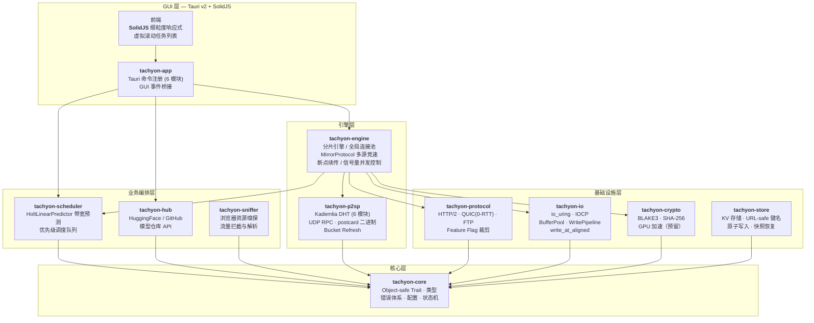
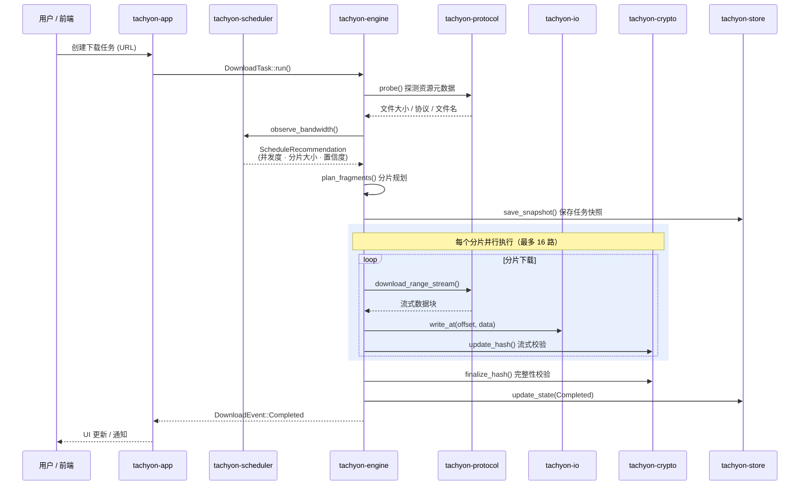
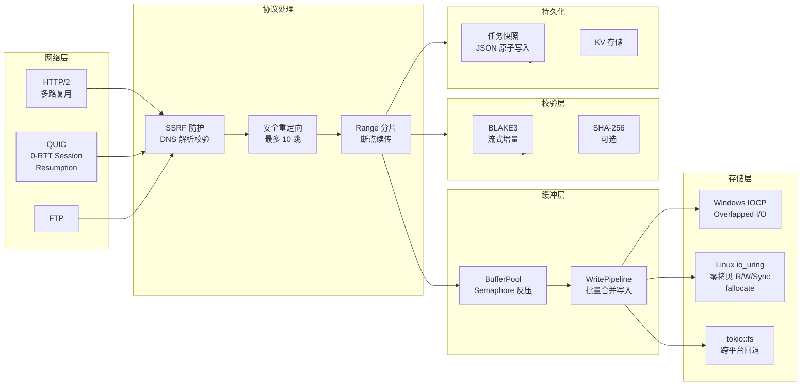
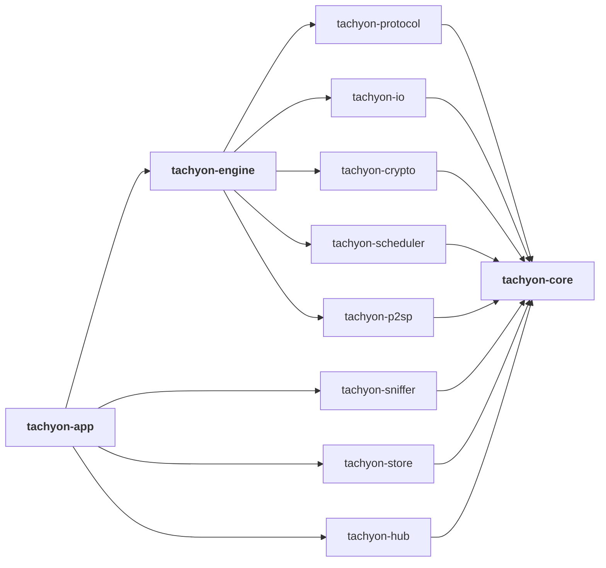

<h1 align="center">Tachyon</h1>

<p align="center">
  <strong>基于 Rust + Tauri v2 构建的高性能桌面下载器</strong>
</p>

<p align="center">
  <a href="https://github.com/baiye2941/Tachyon/actions/workflows/ci.yml"></a>
  <a href="https://github.com/baiye2941/Tachyon/actions/workflows/ci.yml"></a>
  
  
  
  
  <a href="LICENSE"></a>
  
</p>

---

## 核心能力

| 能力 | 说明 |
|:--|:--|
| **多线程分片下载** | 16 并发动态分片，HoltLinearPredictor 带宽预测自适应调整，支持 HTTP Range 断点续传 |
| **QUIC + 0-RTT** | 基于 QUIC 协议实现零往返时间建连，自动缓存 session ticket，0-RTT 被拒时透明回退 1-RTT |
| **MP-QUIC 多路径传输** | 单连接多路径传输框架就绪（QuicTransport 已完备，多路径聚合待集成） |
| **多源竞速下载** | MirrorProtocol 多源并行竞速（Happy Eyeballs v2 / RFC 8305），500ms 快速超时主源，全源 JoinSet 并行 probe |
| **零拷贝存储引擎** | io_uring SQE/CQE 全操作路径（read/write/fsync/fallocate，Linux），IOCP Overlapped I/O（Windows），write_at_aligned 对齐写入 API，WritePipeline 按实际 I/O 数精确消耗信号量 |
| **磁盘空间预分配** | Linux `fallocate` / Windows `SetFileInformationByHandle` 预分配真实磁盘块，防止 ENOSPC |
| **流式哈希校验** | 分片数据流式 BLAKE3 增量校验，峰值内存 O(chunk) 而非 O(fragment) |
| **P2SP 混合下载** | Kademlia DHT（6 模块拆分）+ UDP RPC（PING/FIND_NODE/FIND_VALUE/STORE），迭代查找、分布式存储、周期性 Bucket Refresh、postcard 二进制序列化（减少 50-70% 包体积） |
| **GPU 加速校验** | 通过 Vulkan Compute / WebGPU 对分片做并行哈希校验（框架就绪） |
| **智能调度与预测** | 基于 HoltLinearPredictor（双指数平滑）的带宽预测模型，提前分配连接资源 |
| **协议级优化** | HTTP/HTTPS（含 HTTP/2）/ QUIC / FTP 多协议，全协议真流式下载（64KB chunk 逐块读写） |
| **协议裁剪** | Feature Flag 控制 FTP/QUIC 编译，`--no-default-features` 仅构建 HTTP 以减小二进制体积 |
| **限速控制** | 令牌桶算法全局下载速度限制，不占用额外带宽 |

## 快速开始

### 环境要求

| 依赖 | 最低版本 | 说明 |
|:--|:--|:--|
| Rust | 1.85+ | edition 2024 |
| Bun | 最新 | 前端包管理与构建 |
| Node.js | 18+ | Tauri CLI 依赖 |
| cargo-tauri | 2.x | Tauri 开发与构建工具 |

### 安装与构建

```bash
# 克隆仓库
git clone https://github.com/baiye2941/Tachyon.git
cd Tachyon

# 构建（调试模式，默认启用全部协议）
cargo build

# 构建（发布模式，启用 LTO 和全量优化）
cargo build --release

# 仅构建 HTTP 协议（裁剪 FTP/QUIC，减小二进制体积）
cargo build --no-default-features

# 按需启用协议
cargo build --features ftp      # HTTP + FTP
cargo build --features quic     # HTTP + QUIC
cargo build --features "ftp,quic"  # 全部协议（同默认）
```

### 开发模式

```bash
# 安装前端依赖并启动前端开发服务器
cd frontend && bun install && bun run dev

# 启动 Tauri 开发模式（同时启动前端 + Rust 后端）
cargo tauri dev
```

## 架构

### 分层架构总览



依赖方向**单向无环**：`core → {protocol, io, crypto, scheduler} → engine → app`，禁止跨层绕行。

### 下载任务执行流程



### 数据流：从网络到磁盘



### Crate 依赖关系



## 模块说明

| Crate | 职责 | 关键技术 |
|:--|:--|:--|
| `tachyon-core` | 核心类型、object-safe trait 定义、错误体系、配置与事件 | `thiserror`, `serde`, `strum`, `Pin<Box<dyn Future>>` |
| `tachyon-engine` | 分片引擎、全局连接池、MirrorProtocol 多源竞速（Happy Eyeballs v2）、断点续传 | `tokio`, `quinn`, `bytes`, `Semaphore` |
| `tachyon-scheduler` | 智能调度器、带宽预测、优先级队列 | HoltLinearPredictor, `BinaryHeap` |
| `tachyon-io` | 跨平台异步文件 I/O、BufferPool、WritePipeline、write_at_aligned 对齐写入 | `tokio`, `io-uring`, IOCP |
| `tachyon-protocol` | HTTP/HTTPS/QUIC(0-RTT)/FTP 全流式协议，Feature Flag 裁剪 | `reqwest`, `quinn`, `suppaftp` |
| `tachyon-sniffer` | 浏览器资源嗅探、流量拦截与解析 | `url`, playwright MCP |
| `tachyon-crypto` | CPU/GPU 哈希校验、完整性验证 | `blake3`, `sha2`, `wgpu` |
| `tachyon-p2sp` | Kademlia DHT（6 模块拆分）、UDP RPC、迭代查找、Bucket Refresh、postcard 二进制序列化 | 自研 Kademlia + `tokio::net::UdpSocket` + `postcard` |
| `tachyon-store` | 断点续传持久化、KV 存储（URL-safe 键名编码）、任务快照恢复 | JSON 原子写入 |
| `tachyon-hub` | HuggingFace / GitHub LFS 模型仓库 API | REST API 对接 |
| `tachyon-app` | Tauri 应用入口、模块化命令（6 子模块）、GUI 事件桥接 | `tauri` v2 |

## 技术栈

<p>
  
  
  
  
  
  
  
  
  
</p>

| 功能 | Crate / 工具 | 说明 |
|:--|:--|:--|
| 异步运行时 | `tokio` | multi-thread, full features |
| QUIC 协议 | `quinn` | 基于 rustls 的 QUIC 实现，支持 0-RTT session resumption（`quic` feature） |
| io_uring | `io-uring` / `tokio-uring` | Linux 异步 IO 接口，read/write/fsync/fallocate 全操作路径（按需启用） |
| HTTP 客户端 | `reqwest` | 基于 hyper，支持 rustls-tls + HTTP/2 |
| 桌面框架 | `tauri` v2 | 跨平台桌面应用框架 |
| GPU 计算 | `wgpu` | WebGPU / Vulkan Compute（预留） |
| 哈希算法 | `blake3`, `sha2` | 高性能哈希与校验 |
| 序列化 | `serde`, `serde_json`, `postcard` | JSON 结构化数据 + postcard 二进制（DHT 消息，减少 50-70% 包体积） |
| 错误处理 | `thiserror` | 结构化错误体系 |
| 枚举辅助 | `strum` | derive Display / FromStr，消除手写样板 |
| 日志 | `tracing` | 结构化日志与过滤 |
| FTP | `suppaftp` | 异步 FTP 客户端，真流式 64KB chunk 读取（`ftp` feature） |
| 属性测试 | `proptest` | 基于属性的随机测试 |
| 基准测试 | `criterion` | 统计学基准测试框架 |
| Mock 框架 | `mockall` | trait 与函数 mock |
| 带宽预测 | HoltLinearPredictor（自研） | 双指数平滑模型（原 Holt-Winters 别名已废弃） |

## 项目结构

```
Tachyon/
├── Cargo.toml                  # workspace 根配置
├── LICENSE                     # MIT / Apache-2.0 双许可
├── README.md                   # 本文件
├── crates/
│   ├── tachyon-core/           # 核心类型与 trait 定义
│   ├── tachyon-engine/         # 分片引擎与连接管理
│   ├── tachyon-scheduler/      # 智能调度器
│   ├── tachyon-io/             # 跨平台异步文件 I/O
│   ├── tachyon-protocol/       # 多协议适配（Feature Flag 裁剪）
│   ├── tachyon-sniffer/        # 浏览器资源嗅探
│   ├── tachyon-crypto/         # CPU/GPU 哈希校验
│   ├── tachyon-p2sp/           # Kademlia DHT + UDP RPC
│   │   └── src/dht/            # DHT 模块（6 子模块拆分）
│   │       ├── mod.rs            模块入口与文档
│   │       ├── kademlia.rs       KademliaDht 核心逻辑、本地存储、Bucket Refresh
│   │       ├── kbucket.rs        K-Bucket 路由表
│   │       ├── message.rs        Kademlia 消息定义
│   │       ├── node.rs           NodeId / NodeInfo
│   │       └── transport.rs      UDP 传输层、postcard 序列化、周期性刷新
│   ├── tachyon-store/          # 持久化存储
│   ├── tachyon-hub/            # 模型仓库 API
│   └── tachyon-app/            # Tauri 应用入口
│       └── src/commands/       # 按功能拆分的命令模块
│           ├── mod.rs            公共类型与状态管理
│           ├── task_commands.rs  任务生命周期管理
│           ├── config_commands.rs 配置读写与校验
│           ├── sniffer_commands.rs 资源嗅探
│           ├── hub_commands.rs   HuggingFace Hub
│           └── progress_commands.rs 进度订阅
├── frontend/                   # Tauri 前端 (Bun + SolidJS)
│   └── src/components/         # 20 个活跃组件（含虚拟滚动任务列表）
├── tests/                      # 集成测试
├── benches/                    # criterion 基准测试
└── docs/                       # 架构文档 (本地)
```

## 测试

```bash
# 运行全部测试（831 个测试，含单元测试 + 集成测试）
cargo test --all

# 运行指定 crate 的单元测试
cargo test -p tachyon-core --lib

# 运行指定测试（精确匹配）
cargo test -p tachyon-core -- test_name --exact

# 验证协议裁剪（仅 HTTP）
cargo test -p tachyon-protocol --no-default-features --lib

# 验证协议裁剪（HTTP + FTP）
cargo test -p tachyon-protocol --features ftp --lib

# 代码检查（clippy 零警告）
cargo clippy --all-targets --all-features -- -D warnings

# 格式检查
cargo fmt --all -- --check

# 测试覆盖率（目标 80%+）
cargo llvm-cov --all --fail-under-lines 80
```

### 测试策略

项目采用六类测试覆盖：正常路径、空值处理、边界值、并发安全、外部故障、恶意输入。使用 `proptest` 进行属性测试，`tokio::test` 进行异步测试，`mockall` 隔离外部依赖。测试严格跟随各自模块文件，每个子模块维护独立的 `#[cfg(test)]` 测试块。当前共 **831 个测试**覆盖 11 个 crate。

## 基准测试

```bash
# 运行全部基准测试
cargo bench
```

| 基准测试 | 测量内容 |
|:--|:--|
| `buffer_pool` | 缓冲区池分配与回收性能 |
| `crypto_hash` | BLAKE3 / SHA-256 哈希计算吞吐 |
| `fragment_planning` | 分片规划算法效率 |
| `hex_encode` | Hex 编码吞吐量 |
| `write_pipeline` | WritePipeline 写入管道性能 |
| `e2e_download` | 端到端下载流程集成性能 |

### 发布构建优化

```toml
[profile.release]
opt-level = 3       # 最高优化级别
lto = true          # 链接时优化
codegen-units = 1   # 单编译单元（更优的内联与优化）
strip = true        # 剥离符号表（减小二进制体积）
panic = "abort"     # 恐慌时直接终止（减小体积）
overflow-checks = false
```

## CI/CD

项目使用 GitHub Actions 进行持续集成，包含 **10 个并行 Job**：

| Job | 说明 |
|:--|:--|
| **fmt** | `cargo fmt --check` 格式检查 |
| **clippy** | `cargo clippy -D warnings` 零警告 |
| **test** | 三平台矩阵测试（Ubuntu / Windows / macOS） |
| **docs** | `cargo doc --no-deps` 文档构建（零警告） |
| **audit** | `cargo-deny check` 许可证与依赖策略 |
| **cargo-audit** | `cargo audit` 安全漏洞扫描 |
| **coverage** | `cargo llvm-cov` 覆盖率 ≥ 80% |
| **miri** | Miri 检测 unsafe 代码（内存安全） |
| **bench** | Criterion 基准测试 + 性能回归检测 |
| **frontend** | TypeScript 类型检查 + 前端构建 |

## 贡献指南

1. Fork 本仓库并创建特性分支
2. 遵循 Rust 命名规范，代码标识符使用英文
3. 注释、文档、提交信息使用中文
4. 提交信息格式：`<类型>(<范围>): <简要描述>`
5. 确保 `cargo clippy --all-targets --all-features -- -D warnings` 零警告
6. 确保 `cargo fmt --all -- --check` 通过
7. 新功能需附带测试，测试跟随对应模块文件，覆盖率不低于 80%
8. 协议层改动需验证 `--no-default-features` 编译通过
9. 提交 Pull Request 前运行 `cargo test --all` 确保全部通过

## 许可证

本项目采用 **MIT** 或 **Apache-2.0** 双许可，可任选其一。详见 [LICENSE](LICENSE)。
